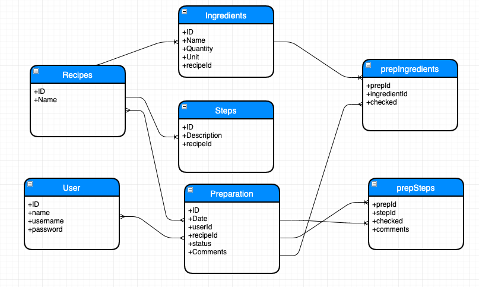
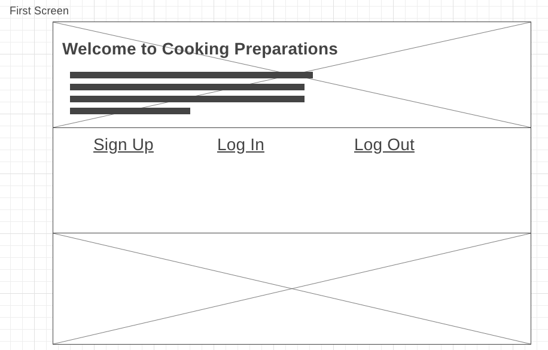
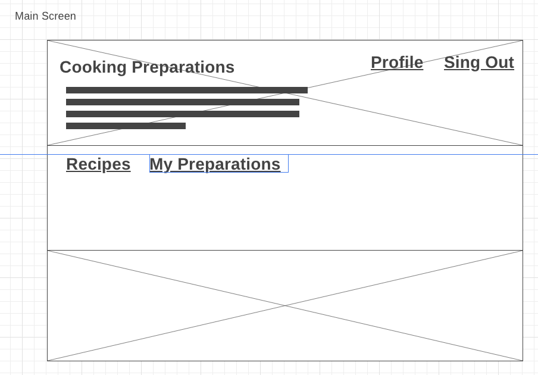
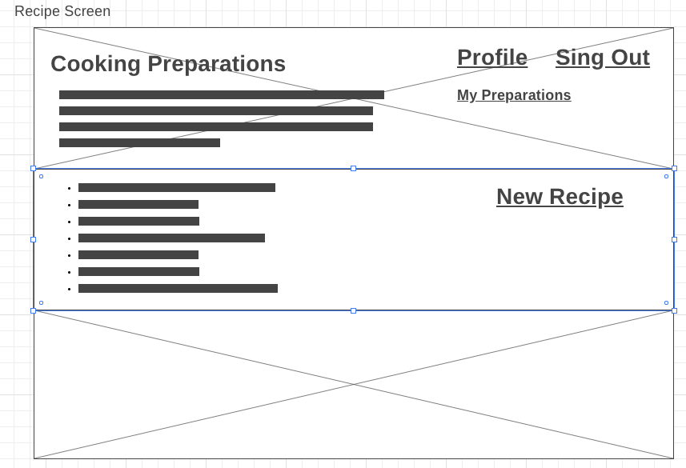
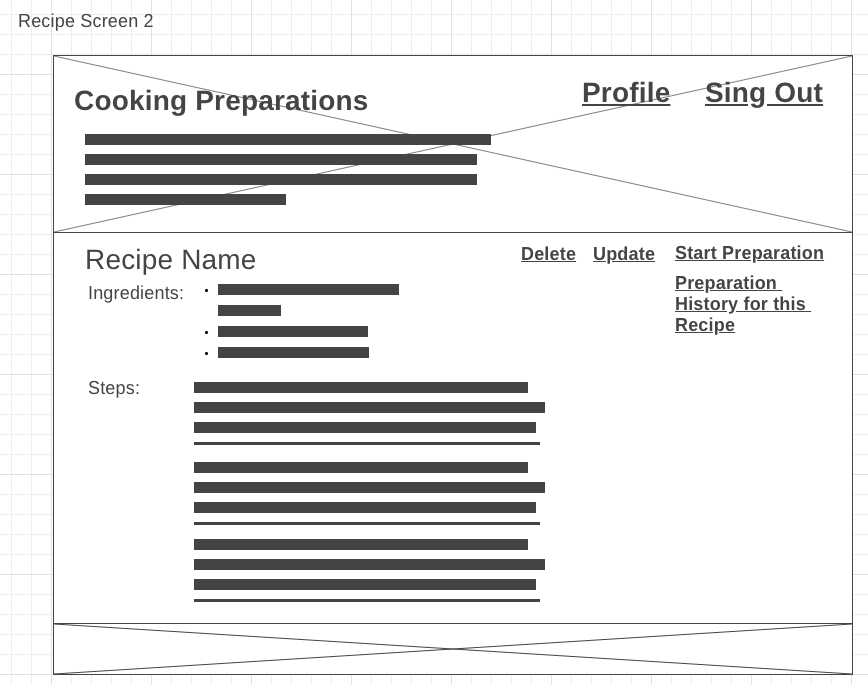
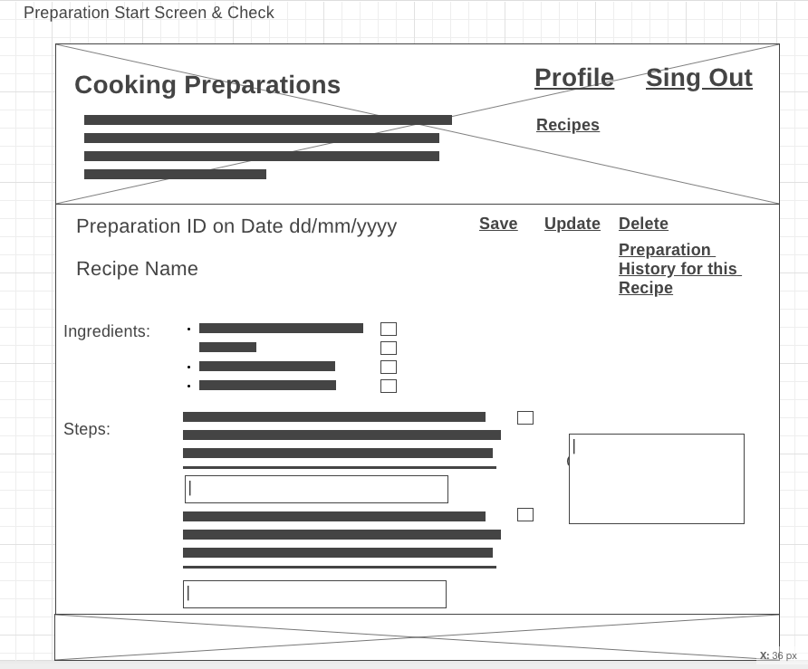
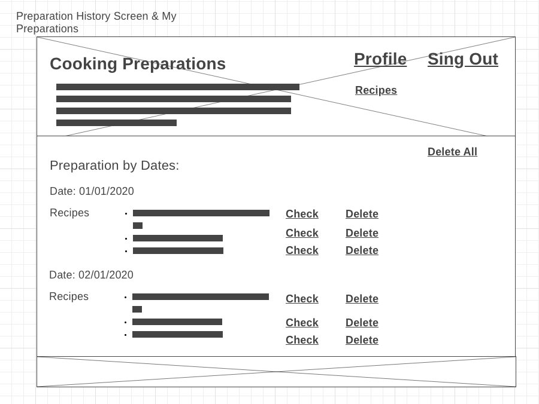

## Deere Project 2 Starter Code

## Set Up

1. Fork and clone this repo
1. `cd` into the folder and run `npm install`
1. In the root of your app, `touch .env` and add:

   ```bash
   PORT=3000
   JWT_SECRET=pancakes
   ```

1. Check out your `config/config.json` file. You'll need to create a database called `project2_development`
1. Sequelize is included in the app. You have a `User` model. Run `db:migrate` to create the `Users` table in your database.
1. Run `nodemon` and go to the Homepage: `localhost:3000/`


<br>

## Routes

You have the following routes available.

#### controllers/authController.js

- GET and POST `localhost:3000/auth/signup`
- GET and POST `localhost:3000/auth/login`
- GET `localhost:3000/auth/logout`

#### controllers/usersController.js

- GET `localhost:3000/profile/:id`

<br>

## Additional Resources

- [Fruit App Solution](https://git.generalassemb.ly/jdr-0622/fruit-app-in-class)
- [Pokemon Express Solution](https://git.generalassemb.ly/jdr-0622/pokemon-express-sequelize6)
- [Google Routes Spreadsheet](https://docs.google.com/spreadsheets/d/14-LHKXLtEkp_vKEz3qSKjREnrmSyzQ9fimTlmrPsZsQ/edit#gid=0)
- [JSON Web Tokens](https://jwt.io/)

User Stories:

1.- Design the database.

As a system analyst I want to design a database so that I can have the database for the "Cooking Preparations Site"

Description:
Have a database design that allows me to start my Cooking Preparations Site.

Definition of done:
Database design completed.



User Stories:

1.- Design the database.

As a system analyst I want to design a database so that I can have the database for the "Cooking Preparations Site"

Description:
Have a database design that allows me to start my Cooking Preparations Site.

Definition of done:
Database design completed.

2.- Have the wireframe.

As a system analyst I want to have the wireframe so that I know the look and feel of my site and the screens I'll have.

Description:
Wireframe the general look and feel of the site. Also, wireframe the screens for recipes and preparations.

Definition of done:
Wireframe completed.

Wireframe for the look and feel:


Wireframe for the main screen:


Wireframe for the Recipes:



Wireframe for the Preparations:



3.- Create the migrations and models files.

As a system analyst I want to create the migration and models files so that I can have the database with their tables.

Description:
Create the migration files with all their relationships in the database.
Also create the models files.

Definition of done:
Migrations files completed.
Models files completed.

4.- Create the Seeds files.

As a system analyst I want to create the seeds files so that I can have information in my tables and can start working on further design.

Description:
Create the seeds files with information about Recipes, Ingredients and steps.

Definition of done:
Seeds files completed.

5.- Look and feel of the site. Work on CSS and .ejs files.

As a system analyst I want to modify my css file & the .ejs files so that I can have the look and feel of the site and be able to replicate it for the new .ejs files that I need.

Description:
Modify current .ejs files:
index.ejs
login.ejs
profile.ejs
signup.ejs

Definition of done:
Ejs files modified.

6.- Work on the recipes .ejs

As a system analyst I want to have the .ejs files of my main screen and the recipes with the look and feel from the wirefram so that I be able to display the info I need and be prepared for CRUD.

Description:
Create the following .ejs files:
One for Main Screen.
Recipe Screen (as in the first wireframe image, for checking all the existing recipes).
Recipe Screen2 (This will allow me to do CRUD operations over the recipes).

Definition of done:
Ejs files created.


7.- Work on the recipes controllers.

As a system analyst I want to have the recipe controllers so that I be able to have the CRUD of them.

Description:
Create a recipeController.js file, with all the functions to be able to do CRUD of the recipes

Definition of done:
Controllers created and completed.


8.- Work on the preparations .ejs files

As a system analyst I want to have the .ejs files of my preparations screens with the look and feel from the wireframe so that I be able to display the info I need and be prepared for CRUD.

Description:
EJS file for CRUD of prepartions.
EJS file for preparation history.

Definition of done:
EJS files completed.

9.- Work on the preparations controller.

As a system analyst I want to have a preparation controller file  so that I be able to do CRUD operations of my 

Description:
Create a preparationController.js file, with all the functions to be able to do CRUD of the preparations.

Definition of done:
Controllers created and completed.

10.- Deployment of my Site.

As a system analyst I want to deploy my site so that everybody will be able to use it.

Description:
Deployment of the site.

Definition of done:
Deployment completed.